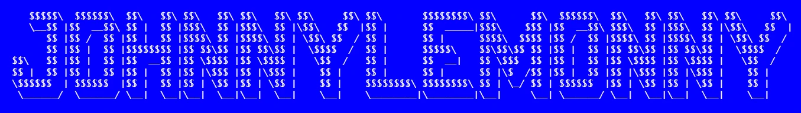

  

<h1 align="center">Hi, I'm Johnny 👋</h1>

  <strong>Frontend & Mobile Developer</strong> 
  Building polished, user-focused web & mobile products.

  I create modern digital experiences with clean UI, smooth UX, and practical product thinking.

  <a href="https://drink-daily.vercel.app/en">🌐 Live Project</a>
  ·
  <a href="https://github.com/johnnylemonny">💻 Open Source</a>
  ·
  <a href="https://dev.to/johnnylemonny">✍️ DEV.to</a>
  ·
  <a href="https://buymeacoffee.com/zdfpbnc5iv">☕ Buy Me a Coffee</a>

  
  
  

---

## About Me

I'm a developer focused on building modern products that feel **fast, intuitive, and refined**.

My core strength is frontend development, complemented by mobile and cross-platform work using **React Native** and **Kotlin**. I care about software that is not only technically solid, but also **useful, lightweight, and pleasant to use from the very first interaction**.

- ⚡ Crafting fast, clean, and visually polished interfaces
- 🎯 Strong focus on product thinking over pure technical demos
- 📱 Building mobile apps with **React Native** and **Kotlin**
- 🌌 Exploring interactive experiences with **Three.js**
- 🚀 Growing an open-source portfolio of production-quality projects

---

## Featured Project

### 🥤 Drink Daily

A modern hydration tracking app designed to be **free, registration-free, and genuinely useful from the first visit**.

**Highlights**
- daily hydration tracking
- frictionless UX with **no sign-up required**
- polished, real-product feel
- clean interface designed for everyday use

  <a href="https://drink-daily.vercel.app/en"><strong>→ Visit Drink Daily</strong></a>

---

## Selected Projects

A selection of public projects showcasing my work across modern frontend development, polished UX, and product-focused execution.

### NutraFlux
Professional, private, and local-first calorie tracker built for speed, privacy, and a modern web experience.

  <a href="https://github.com/johnnylemonny/NutraFlux">🔗 Repository</a>

### ExoVault
A premium, high-performance explorer for the NASA Exoplanet Archive, built for elegant discovery and scientific storytelling.

  <a href="https://github.com/johnnylemonny/ExoVault">🔗 Repository</a>

  
  

---

## Tech Stack

### Frontend

  
  
  
  
  
  
  
  
  
  

### Mobile

  
  

### Interactive / Other

  
  

---

## Current Focus

- building and refining public web projects
- improving mobile development workflows
- shipping more polished, production-ready software
- expanding open-source presence
- exploring richer UI and interaction patterns

---

## Elsewhere

- GitHub → [github.com/johnnylemonny](https://github.com/johnnylemonny)
- DEV.to → [dev.to/johnnylemonny](https://dev.to/johnnylemonny)
- Buy Me a Coffee → [buymeacoffee.com/zdfpbnc5iv](https://buymeacoffee.com/zdfpbnc5iv)

---

  Built with clarity, interaction, and a product mindset.

